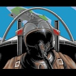
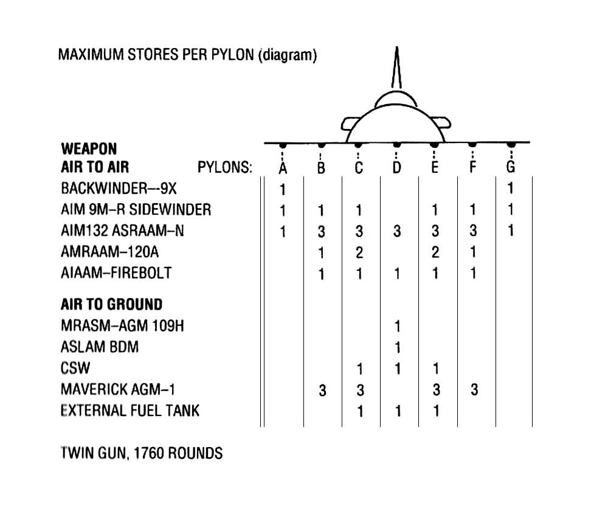
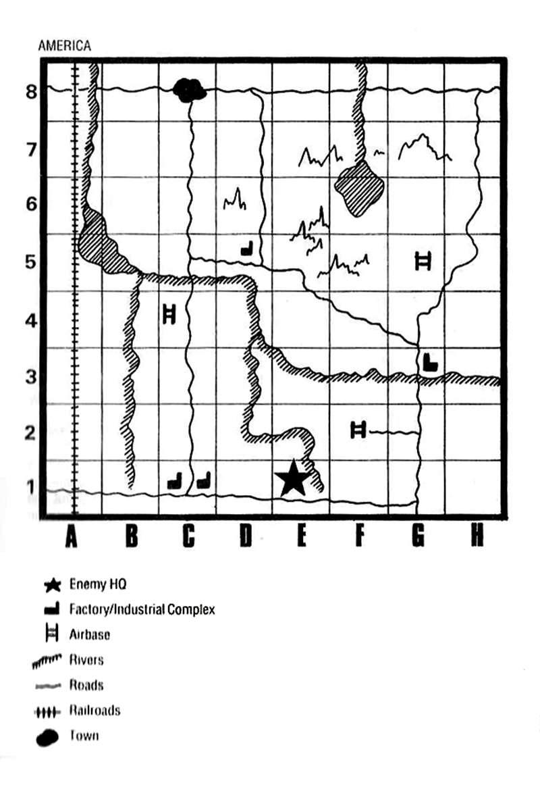
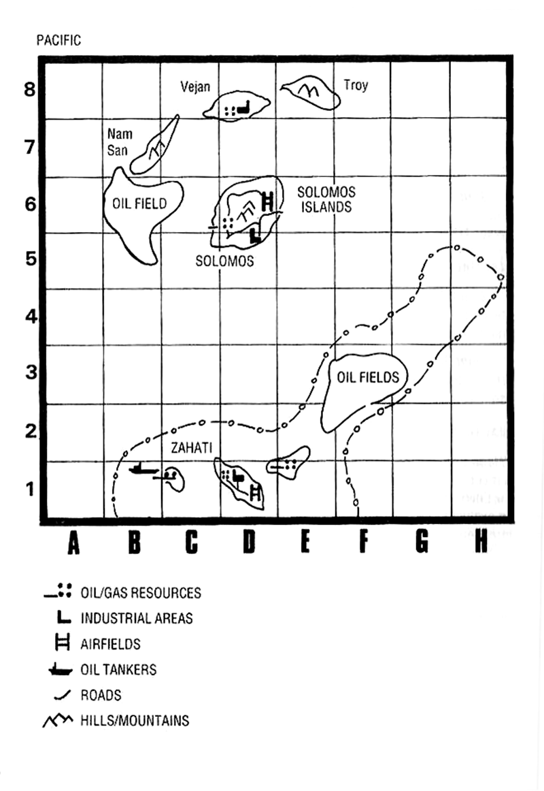
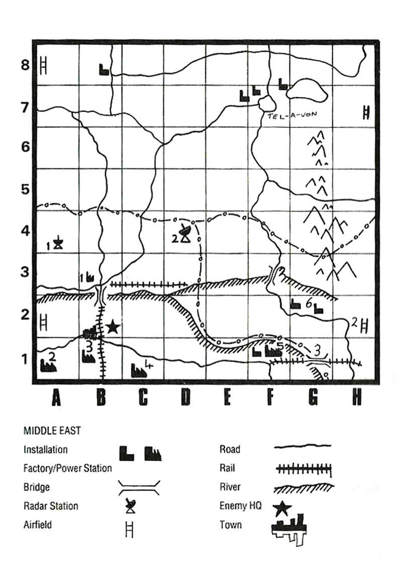
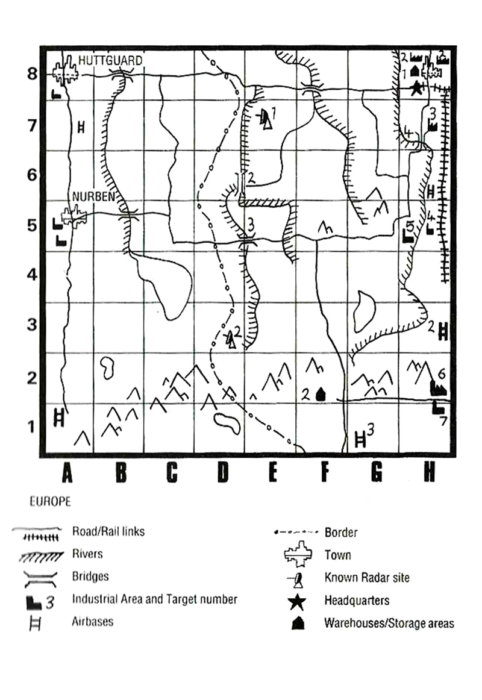
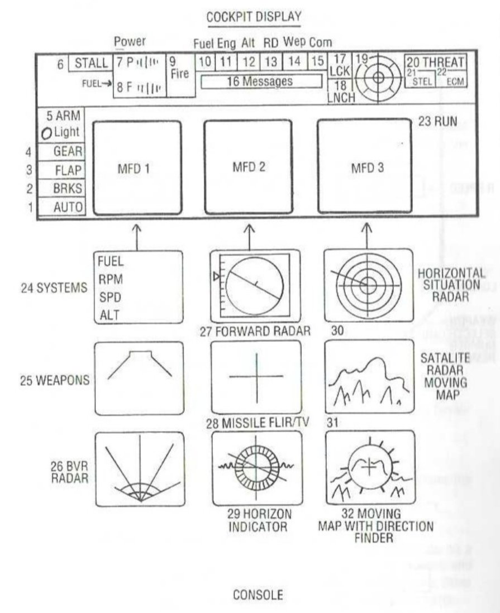
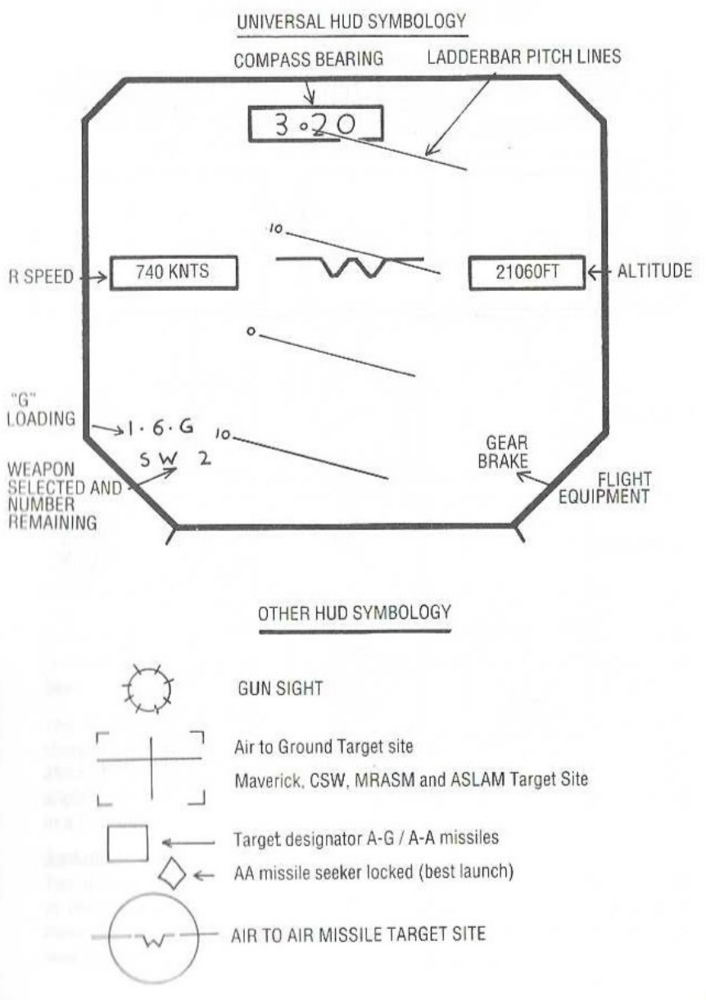

# F29 Retaliator Game Documentation (Steam Guide Derivative)

Source guide: https://steamcommunity.com/sharedfiles/filedetails/?id=2169692478  
Guide title on Steam: F29 Retaliator Manual - 2020 Edition  
Scope of this document: detailed, paraphrased technical and gameplay reference created from the Steam guide.

## Media Assets Downloaded

The following guide images were downloaded to support this documentation:

- 
- 
- 
- 
- 
- 
- 
- 

## 1) Quick Start Summary

- Enter any text at the Pilot Authorisation prompt to continue in the Steam release.
- Choose rank, scenario, aircraft (F-22 or F-29), and armament.
- Use Mission Control for mission picks, map updates, base selection, and pilot log.
- Missions are considered complete only after safe landing.
- Friendly-fire and civilian damage can heavily penalize results.

## 2) Copy Protection Note (Steam Version)

The legacy Pilot Authorisation challenge is effectively bypassed in this release. Any text input is accepted to proceed.

## 3) Setting and Scenario Context

The game frames a near-future combat environment with two high-end aircraft concepts:

- F-22 style Advanced Tactical Fighter profile (air superiority, long range, high performance).
- F-29 forward-swept-wing concept (high agility emphasis and advanced avionics framing).

Pilot role:

- Penetrate SAM belts.
- Strike radar, AWACS, logistics, and infrastructure.
- Support friendly ground offensives and defensive operations.
- Sustain high kill efficiency to avoid strategic defeat.

## 4) Aircraft and Flight-Model Highlights

### F-29 / F-22 concept highlights

- Stealth and reduced radar exposure are core tactical themes.
- Supercruise, high-altitude performance, and high-G maneuvering are central to mission success.
- Combat success relies on balancing speed, altitude, and survivability against integrated air defenses.

### Approximate dimensions listed in guide

- YF-29: length 14.63 m, height 4.7 m, wingspan 8.23 m
- YF-22A: length 21.3 m, height 4.29 m, wingspan 13.11 m

## 5) Main Menus and Mission Control

## Main Selection Computer

1. Enrol Data Bank
- Create/select pilot and rank (1st Lt through Colonel).
- Higher rank: tougher missions but higher scoring multipliers.

2. Scenario Selection
- Arizona test range
- Middle East campaign
- Pacific campaign
- Europe campaign

3. Plane Selection
- Pick F-22 or F-29.

4. Armament Selection
- Configure payload by pylon, capacity, and availability.

5. Top Pilots
- Shows top score table.

6. Zulu Alert
- Fast-entry practice combat with unlimited weapons; no persistent progression.

7. Mission Control
- Enter campaign map update flow and mission assignments.

## Mission Control Functions

1. Choose Mission (depends on rank, theater, and campaign progress)
2. Display War Update (current frontline/intel context)
3. Select Base (home/start base)
4. View Pilot Log (career stats)
5. Exit Mission Control
6. Accept Mission (launch into operation)

## 6) Weapons and Payload Reference

### Payload constraints

- ATF payload limit: 11,000 lb
- FSW payload limit: 9,000 lb
- Availability varies by theater, base, rank, and campaign attrition.

### Air-to-air weapons

1. AIAAM Fire Bolt
- Long-range active/intercept role
- Approx stats: 980 lb, 250 km range, Mach 5

2. AMRAAM 120A
- Medium-range BVR role
- Approx stats: 326 lb, 50 km range, Mach 4

3. AIM9M-R Sidewinder
- Short-range IR role
- Approx stats: 190 lb, 11 mi range, Mach 3

4. AIM132 ASRAAM-N
- Agile short-range IR role
- Approx stats: 156 lb, 9 mi range, Mach 3

5. Back-Winder 9X
- Rear-aspect tactical defensive/off-axis role
- Approx stats: 180 lb, 6 mi range, Mach 3

### Air-to-surface weapons

1. MRASM / AGM-109H cruise class
- Airfield/runway standoff strike
- Approx stats: 2,825 lb, 370 mi, 650 mph

2. ASALM
- Long-range hardened-target / high-value target strike (also anti-AWACS role in guide context)
- Approx stats: 3,100 lb, 700 mi, Mach 3.5-4.5

3. Maverick AGM family variant
- Precision guided strike against tactical ground targets
- Approx stats: 484 lb, 25 mi, Mach 1.6

4. CSW
- Multi-submunition standoff strike, anti-armor emphasis
- Approx stats: 2,700 lb, 30 mi, Mach 1.1

### Identification and IFF behavior

- Enemy vehicles generally use dark-gray visual scheme.
- Friendly forces appear green/brown.
- Friendly aircraft are excluded from hostile radar target behavior and missile lock logic via IFF safeguards.

## 7) Mission Completion and Scoring

### Mission completion rule

A mission is counted as complete only after landing safely at a valid base.

### Rank-based scoring multipliers (as described)

- 1st Lt = base score
- Captain = 2x
- Major = 3x
- Lt. Col = 5x
- Colonel = 7x

### Medal progression (campaign milestones)

1. Purple Heart
2. Airman's Medal
3. Distinguished Flying Cross
4. Silver Star
5. Air Force Cross
6. Medal of Honour

## 8) Theater Mission Catalog

## 8.1 America (Arizona Test Range)

Map image: 

Reference points from guide:
- 1E: mock command center
- 5G: mock enemy airbase
- 8E: truck target area

Mission sequence (training range):

1. Strike canvas targets in 7B.
2. Destroy moving truck convoy across sector band 8A-8H.
3. Hit rail targets in A3.
4. Eliminate SAM sites and radar control in 5D.
5. Strike test bridge; avoid SAM simulators around F8.
6. Engage drone MiG-29 fighters; destroy at least two.
7. Attack mock tank formations in 3A.
8. Destroy industrial complex in 1C.
9. Destroy enemy airbase and runway in 4C.
10. Destroy command center in 1E while surviving dense SAM defenses.

Special caution: unauthorized target destruction can trigger severe penalties.

## 8.2 Pacific Campaign

Map image: 

Key map references from guide:
- 6D: player base
- 6B: critical oil fields
- 1D: hostile island buildup and heavy flak risk

War Update 1

1. Operation Scramble: intercept two incoming bandits near 4D.
2. Operation Firebolt: repel attack near 8D; down at least three fighters.
3. Operation Drop-in: sink enemy battleship near 4G (watch radar defenses).
4. Operation Plunge: strike oil storage on Zahiti (2E).

War Update 2

1. Operation Splash: stop amphibious assault near 8E; destroy landing craft and counter MiG cover.
2. Operation Warmup: destroy two incoming frigates in 3B.
3. Operation Deep Heat: intercept and destroy long-range strike aircraft near 4B.
4. Operation Beta-1: cripple super tanker Azov in 4G under MiG protection.

War Update 3

1. Operation Revenge: support friendly naval engagement around 7H; counter MiGs and strike cruisers.
2. Operation Arc: break major fleet assault from southern approach; clear fighter cover and ships.
3. Operation Strike Back: coordinate with arriving US task force; sink at least two enemy ships.
4. Operation Stamps: destroy gas/refinery target on Zahiti in 1D.

War Update 4

1. Operation Knock-Out: locate/destroy carrier Leonid Brezhnev and support ship (1G).
2. Operation Fight Back: defend priority fleet units and destroy two battleships (F4 area).

War Update 5

1. Operation Hand Shake: cease-fire patrol mission with sabotage risk during peace-meeting security.

## 8.3 Middle East Campaign

Map image: 

Key map references from guide:
- 4D: dangerous tracking radar position
- 1F: Lac Mi-El tank concentration
- 1C: chemical-production target area

War Update 1

1. Operation Bravo: destroy tank brigade in 5A.
2. Operation Bogie: intercept two MiGs near 6F.
3. Operation Alpha: destroy tracking radar in 4D.
4. Operation Foxstrike: destroy bridge in 3F.
5. Operation Lizard: eliminate mixed armored column in 4C.
6. Operation Charlie: deep-strike enemy airfield in 2H.

War Update 2

1. Operation Moonstruck: destroy munitions industry in 3B.
2. Operation Rogue: destroy power station in 2F.
3. Operation Pincer: locate and eliminate two enemy tank battalions per war map.
4. Operation Torch: destroy tracking station in 4A.
5. Operation Crossfire: destroy oil refinery and tanks in 1F.

War Update 3

1. Operation Mayday: intercept three fighters threatening capital (5E).
2. Operation Lord: support front-line armor fights; destroy enemy divisions.
3. Operation Torture: destroy rail bridge in lower 3B.
4. Operation Romeo: destroy tank farm in F1.

War Update 4

1. Operation Heat: locate/destroy large road convoy near 1D.
2. Operation Juno: intercept major hostile air package heading toward capital near 3G.
3. Operation Warrior: destroy chemical processing site in 1C.
4. Operation Gold: support largest tank battle; destroy minimum eight tanks.

War Update 5

1. Operation Ajax: strike capital-region runway in 2A and RTB.
2. Operation Dawn: strike steelworks in 1D while avoiding protected medical site.
3. Operation Zeus: blunt major armored offensive; kill lead battalion.
4. Operation Red: escort strategic logistics convoy against air attack in 7G.

War Update 6

1. Operation Standstill: destroy major factory in 1A while evading heavy SAMs.
2. Operation Vice: destroy lead tanks and supply vehicles in attritional ground battle.
3. Operation Thunder: intercept major fighter push near 4G.

War Update 7

Final chapter with special endgame mission set (details represented as scenario-sensitive).

## 8.4 Europe Campaign

Map image: 

Key map references from guide:
- 2D: major SAM/radar concentration
- 7H: high-value enemy power plant
- 2H: suspected aircraft-production site
- 8H: covert arms output site

War Update 1

1. MiG Cap: scramble intercept of incoming MiGs.
2. Bomb Cap: intercept low-level bomber package with escort.
3. Intercept: stop SU-27s approaching Huttgart (8A).
4. Tom Cat: clear enemy fighter cover over advancing armor (4D).
5. Aggressor: close support; destroy two tank brigades near 6D.
6. Firehand: stop mobile division thrust in 8D.
7. Ironhand: destroy SAM/radar sites along southern border corridor (3D).
8. Backbreaker: destroy key bridge at 5E.
9. Limelight: interdict road convoys near 8F.
10. Linebacker III: deep strike Tranevora runway/hangars in 1G.

War Update 2

1. Jawbreaker: destroy north Stein bridge (6D).
2. Four Star: destroy supply dumps (2F).
3. Big Ear: destroy radar + SAM battery (7E).
4. Deep Throat: strike dense hostile airstrip concentration (3H).
5. Strike Out: intercept major inbound strike package from border (vector 2C).
6. Tin Can Alley: close support against armored assault; destroy two leading battalions.

War Update 3

1. Iron: cut road bridge in 8E.
2. Titan: destroy westbound armor convoy in 8G.
3. Snake Eye: support dual tank battles; destroy MiGs and leading brigades.
4. Grind: destroy industrial machine-parts complex in 5H.
5. Lights Out: cripple riverside power generation in 5H.
6. Fly-by: hunt ace MiG squadron operating from 1D.

War Update 4

1. Wolf: intercept MiG-29C pack in 5C.
2. Avenger: halt fresh tank divisions; destroy at least ten tanks.
3. Thunderbolt: destroy chemical factory and storage tanks in 7H.
4. Bear: attack arms factory in 2H while avoiding nearby SAMs.
5. Express: sever rail network and trains in 4H.
6. Untouchables: intercept flanker bomber squadron threatening airport sector 7A.

War Update 5

1. Venus: provide air cover for Huttgart sector under large fighter assault.
2. Venus 2: provide cover near Nurberg against MiG squadron.
3. Counter: support US tank corps and destroy enemy armor in active sector.
4. Backache: deep strike final major bridge in 7H.
5. Trax: destroy primary tank factory target in 8H.
6. Flame: destroy key fuel storage target in 8H and RTB.

War Update 6

1. Burst: runway centerline strike in 6H under dense SAM threat.
2. Mercury: intercept fighters and any air-launched cruise missiles heading to base.
3. Man Hunt: destroy hostile hardware in major final ground clash.
4. On-Line: disable enemy power grid by striking key power station elements in 7H.
5. Saturn: destroy tank transport train in 7H.
6. Mars: destroy heavily defended aircraft factory in 8H.

War Update 7 (Final)

Three secret missions listed as Saviour, Retaliator, and Hour Glass, with map-guided locations.

## 9) Controls Reference (Functional)

Core control groups covered in the guide:

- View controls: front, rear, left, right, behind, satellite, directional externals.
- Flight systems: thrust +/-, supercruise, flaps, gear, brakes, level wings, autopilot.
- Combat systems: weapon cycle/select, fire, target-lock cycle, break lock.
- Survivability: ECM toggle, stealth toggle, chaff, flare, eject.
- Interface control: HUD toggle, MFD mode toggles, pause.

Operational notes:

- Some weapons require lock confirmation before launch.
- High-speed use of gear/flaps can cause structural damage.
- ECM and countermeasure timing are critical under missile pressure.

## 10) Cockpit / ECOP / HUD Technical Reference

Cockpit image: 
HUD image: 

### ECOP and warning system functions (paraphrased)

- Autopilot status indicator with return-to-combat heading assistance.
- Brake state and damage feedback.
- Flap state with speed-overstress cautions.
- Gear state with overspeed warnings/failure risk.
- Master arm status.
- Stall indication and recovery context.
- RPM and fuel bars for propulsion/endurance management.
- Fire, low fuel, engine, altitude, radar, weapons, and comms warning channels.
- Threat panel indicators: lock, launch warning, RWR threat direction, missile radar threat state.
- Stealth vulnerability state and ECM activity indicators.

### MFD functions summarized

- Systems panel (fuel, speed, altitude, thrust)
- Weapon inventory/selection panel
- BVR radar panel
- Forward-looking radar panel
- Missile camera/FLIR panel
- Attitude/roll information
- Horizontal situation radar (air/ground threat picture)
- Satellite/moving map display
- Direction finder overlay

## 11) Basic Flight Procedure (Training Style)

### Takeoff

1. Build thrust to around 50% while staged on runway.
2. Release brakes and align.
3. Increase toward 80-90% to reach takeoff speed (~200 mph).
4. Rotate gently and retract gear before overspeed risk.

### Level flight

- Use HUD ladder reference to stabilize around zero pitch.

### G-management

- High-speed, high-bank turns can induce blackout/gray-out.
- Aggressive negative-G maneuvers can trigger red-out effects.

### Low-observable profile

- Very low-altitude routing can improve survivability versus radar/SAM coverage.

### Landing

1. Set up aligned final with controlled speed and descent.
2. Configure flaps/gear on approach while managing speed.
3. Touch down, reduce throttle, settle nosewheel, brake to stop.

## 12) Head-to-Head Mode Note

Guide indicates legacy head-to-head code path exists in the game but is not officially supported for the Steam release.

## 13) Practical Campaign Tips (Derived)

- Land every sortie successfully to lock mission completion.
- Use stealth and ECM as complementary tools, not replacements.
- Prioritize radar/SAM suppression before deep strikes.
- Match loadout to mission type: anti-ship, anti-armor, runway strike, CAP/intercept.
- Preserve energy in contested airspace; avoid overcommitting at low altitude near flak belts.
- Watch campaign attrition: ordnance availability can tighten later in theater progression.

## 14) Documentation Notes

- This file is a detailed derivative reference, not a verbatim transcription.
- Mission names and technical facts are preserved where useful for in-game navigation.
- Narrative text and explanations are rewritten and reorganized for easier lookup.
